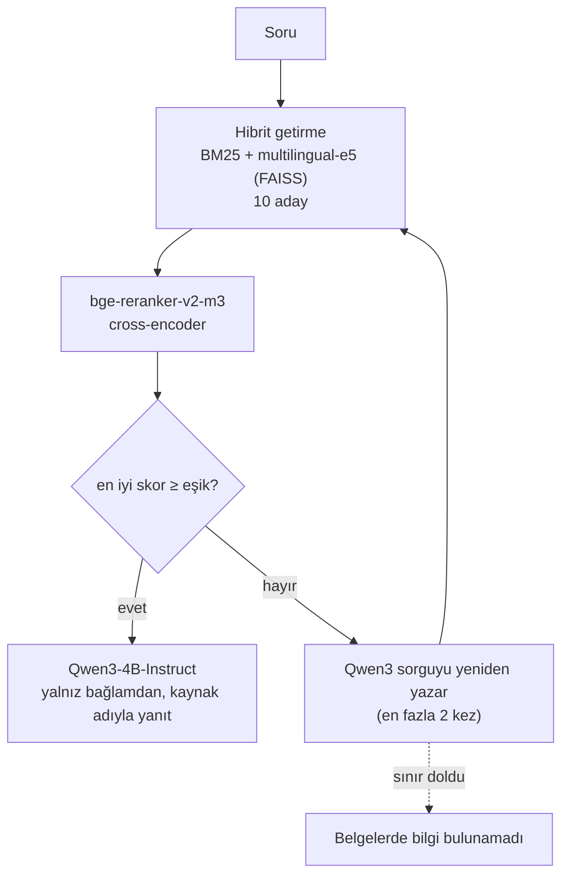
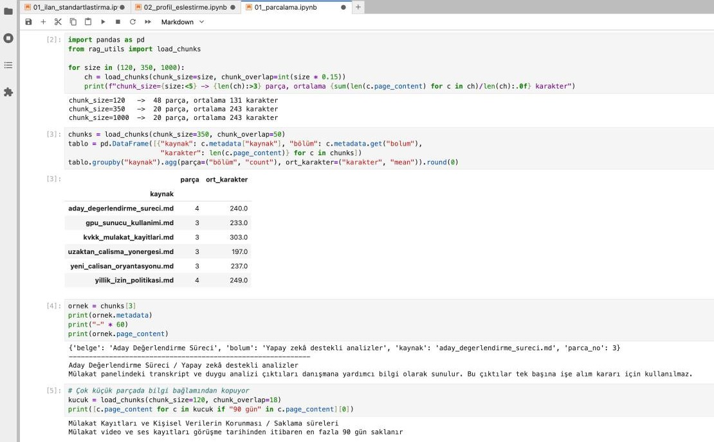
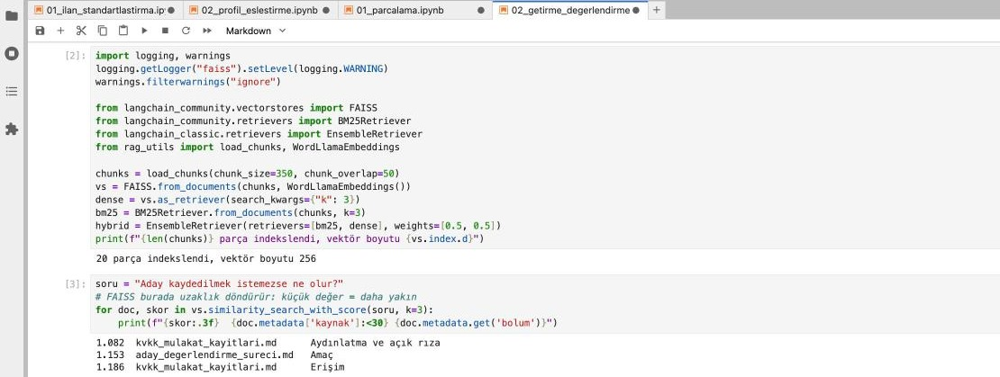
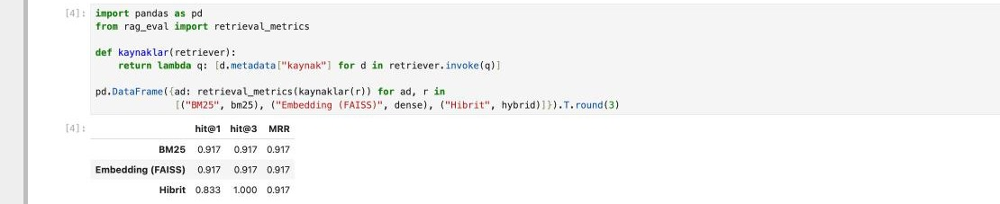
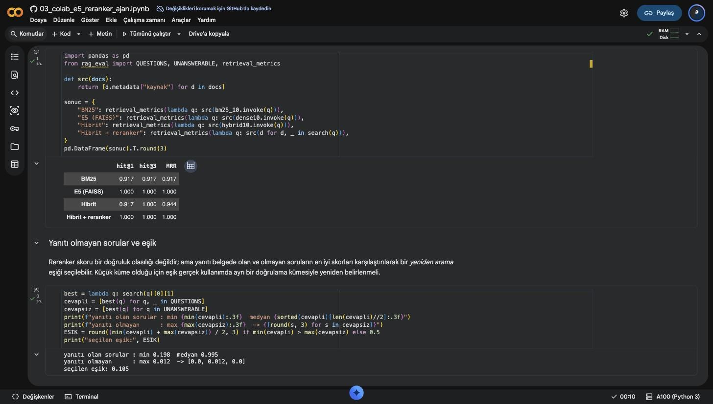
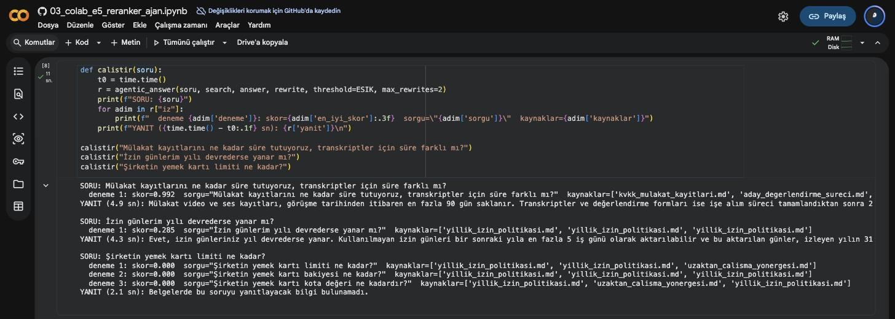
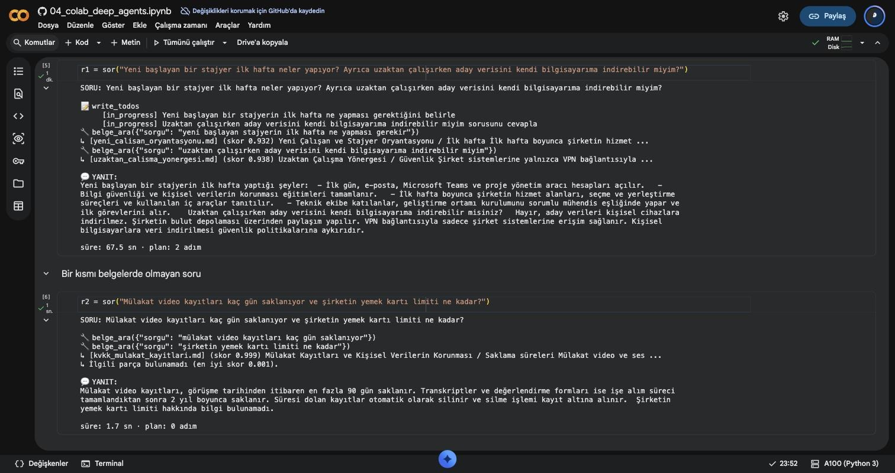
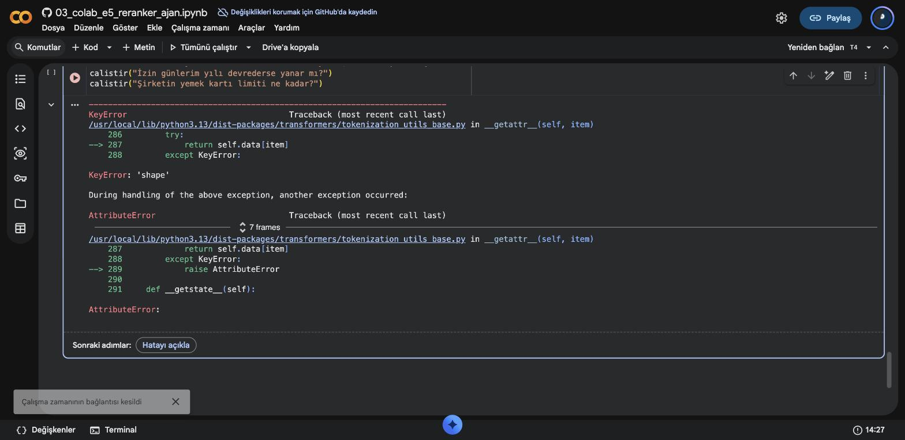

# Türkçe Şirket İçi Belgeler için Agentic RAG

[](https://github.com/alimdemir/agentic-rag-turkish-docs/actions/workflows/ci.yml)
[](https://colab.research.google.com/github/alimdemir/agentic-rag-turkish-docs/blob/main/notebooks/03_colab_e5_reranker_ajan.ipynb)


Şirket içi Türkçe belgeler (izin politikası, KVKK ve mülakat kayıtları, GPU sunucusu kuralları vb.) üzerinde çalışan, **getir → yeniden sırala → gerekirse sorguyu yeniden yaz → kaynaklı yanıt ver** döngüsüne sahip bir RAG sistemi. AVD Teknoloji Danışmanlık'taki stajımın (2026) üçüncü haftasında geliştirdim.

> `belgeler/` klasöründeki 6 belge **sentetik örneklerdir**; gerçek şirket belgelerinin yapısını taklit eder, gerçek içerik barındırmaz.

## Mimari



| Dosya | Görevi |
|---|---|
| `rag_utils.py` | Markdown başlığına + karakter sınırına göre iki aşamalı parçalama; parçanın başına `belge / bölüm` başlığı eklenir. `WordLlamaEmbeddings` (internetsiz) ve `E5Embeddings` (`query:` / `passage:` ön ekleriyle) |
| `rag_eval.py` | 12 soruluk etiketli test kümesi, 3 yanıtsız soru, `hit@1`, `hit@3`, `MRR` |
| `agentic.py` | Eşik ve yeniden yazma sınırı olan ajan döngüsü (model/getiriciden bağımsız, testlerde sahte fonksiyonlarla çalışır) |
| `deep_rag.py` | LangChain Deep Agents ile aynı getirme hattını araç olarak kullanan ajan: `write_todos` ile planlama, `belge_ara` aracı, eşik altı skorda "bulunamadı" |

## Not defterleri

| Not defteri | Ortam | İçerik |
|---|---|---|
| [`01_parcalama`](notebooks/01_parcalama.ipynb) | CPU | Parça boyutu denemeleri; 120 karakterde "90 gün" ile "2 yıl" kuralının ayrı parçalara düşmesi |
| [`02_getirme_degerlendirme`](notebooks/02_getirme_degerlendirme.ipynb) | CPU, internetsiz | WordLlama + FAISS, BM25 ve hibrit getirme karşılaştırması |
| [`03_colab_e5_reranker_ajan`](notebooks/03_colab_e5_reranker_ajan.ipynb) | Colab A100 | multilingual-e5-base + bge-reranker-v2-m3 + Qwen3-4B-Instruct ile ajan döngüsü, eşik seçimi |
| [`04_colab_deep_agents`](notebooks/04_colab_deep_agents.ipynb) | Colab A100 | Deep Agents + Ollama (`qwen3:4b-instruct-2507`): çok konulu soruda plan, konu başına arama, kısmen yanıtsız soru |

### CPU sonuçları (not defteri 02)

| Yöntem | hit@1 | hit@3 | MRR |
|---|---|---|---|
| BM25 | 0.917 | 0.917 | 0.917 |
| Embedding (WordLlama + FAISS) | 0.917 | 0.917 | 0.917 |
| Hibrit (0.5 / 0.5) | 0.833 | **1.000** | 0.917 |

Hibrit yöntem doğru belgeyi her soruda ilk üçe taşıyor ama ilk sıradaki isabet düşüyor. Bu yüzden ilk getirme geniş bir aday havuzu olarak kullanılıyor, sıralamayı reranker yapıyor.

### Colab A100 sonuçları (not defteri 03)

| Yöntem | hit@1 | hit@3 | MRR |
|---|---|---|---|
| BM25 | 0.917 | 0.917 | 0.917 |
| multilingual-e5-base (FAISS) | **1.000** | **1.000** | **1.000** |
| Hibrit (0.5 / 0.5) | 0.917 | 1.000 | 0.944 |
| Hibrit + bge-reranker-v2-m3 | **1.000** | **1.000** | **1.000** |

- Çok dilli E5 modeli, WordLlama'nın kaçırdığı soruyu da ilk sıraya taşıyor. Reranker ise hibrit getirmenin ilk sıradaki kaybını geri alıyor.
- En iyi reranker skoru, yanıtı olan sorularda en az **0.198** (medyan 0.995), yanıtı olmayan sorularda en çok **0.012**. Yeniden arama eşiği **0.105** seçildi.
- Ajan döngüsü: yanıtı olan sorular tek denemede kaynaklı yanıtlandı (A100-SXM4-40GB'de 4.3–4.9 sn; aynı not defteri daha önce T4'te 5–7 sn sürmüştü). "Yemek kartı limiti" sorusunda model sorguyu iki kez yeniden yazdı; skor 0'da kaldı ve sistem **"Belgelerde bu soruyu yanıtlayacak bilgi bulunamadı."** dedi.
- Karşılaşılan sorun: transformers 5'te `apply_chat_template(return_tensors="pt")` tensör yerine `BatchEncoding` döndürdüğü için `KeyError: 'shape'` alındı. Şablon önce metin olarak üretilip ayrıca tokenize edildi.

### Deep Agents (not defteri 04, Colab A100)

`deep_rag.py`, 03'teki hibrit getirme + reranker hattını `belge_ara` adlı tek bir araç olarak [Deep Agents](https://github.com/langchain-ai/deepagents) ajanına veriyor. Model Ollama üzerinden yerelde çalışan `qwen3:4b-instruct-2507`; belge içeriği dışarı çıkmıyor.

| Soru | Plan (`write_todos`) | Aramalar (en iyi skor) | Sonuç | Süre |
|---|---|---|---|---|
| "Yeni başlayan bir stajyer ilk hafta neler yapıyor? Ayrıca uzaktan çalışırken aday verisini kendi bilgisayarıma indirebilir miyim?" | 2 adım | oryantasyon (0.932), uzaktan çalışma (0.938) | İki konu da belgelere dayanarak yanıtlandı | 67.5 sn* |
| "Mülakat video kayıtları kaç gün saklanıyor ve şirketin yemek kartı limiti ne kadar?" | yok | KVKK (0.999), yemek kartı (0.001 → *bulunamadı*) | 90 gün yanıtlandı, yemek kartı için "bilgi bulunamadı" | 1.7 sn |

\* İlk çağrı, modelin GPU belleğine yüklenmesini de içeriyor.

Gözlemler:
- Model iki konulu ilk soruda plan çıkardı ama ikinci soruda plan yapmadan iki aramayı doğrudan başlattı. `write_todos` bir araç olduğu için modelin kullanıp kullanmamasına bağlı; zorunlu bir adım değil.
- Eşik araç içinde uygulandığı için model, belgelerde olmayan konu hakkında tahmin yürütmedi.
- Sistem isteminde `[kaynak]` etiketi istenmesine rağmen yanıtlarda kaynak adı yer almadı; kaynaklar yalnızca araç izinde görünüyor. Bir sonraki adım, kaynağı yanıta modelden bağımsız olarak eklemek.

## Kurulum

```bash
python -m venv .venv && source .venv/bin/activate
pip install -r requirements-dev.txt        # CPU
pytest -v                                  # 8 test
# GPU (Colab) için: pip install -r requirements-gpu.txt
```

## Tasarım kararları

- **Başlık yapısı parça boyutundan önce geliyor.** Bu belgelerde 350 ve 1000 karakterde aynı sayıda parça oluşuyor, çünkü bölümler zaten kısa.
- **FAISS skoru uzaklıktır.** `similarity_search_with_score` L2 uzaklığı döndürür; küçük değer daha yakın demektir.
- **Reranker skoru olasılık değildir.** Eşik, yanıtı olan ve olmayan soruların skorlarına bakılarak seçildi. Küçük küme olduğu için gerçek kullanımda ayrı bir doğrulama kümesi gerekir.
- **Yeniden arama sınırlı.** Sınır dolunca sistem tahmin yürütmüyor, bilginin bulunamadığını söylüyor.

## Ekran görüntüleri

Not defterleri 01–02 MacBook Air (Apple Silicon, Python 3.12, internetsiz WordLlama) üzerinde, 03–04 Colab'da A100 GPU ile çalıştırıldı.

| | |
|---|---|
| <br/>Mac · başlık + karakter sınırıyla parçalama | <br/>Mac · FAISS ile getirilen bölümler |
| <br/>Mac · BM25 / embedding / hibrit karşılaştırması | |
| <br/>Colab A100: E5 + reranker değerlendirmesi | <br/>Colab A100: ajan döngüsü, yeniden yazma ve "bilgi bulunamadı" |
| <br/>Colab A100: Deep Agents planı, araç çağrıları ve "bulunamadı" | <br/>transformers 5 ile `KeyError: 'shape'` |

## Lisans

[MIT](LICENSE)
