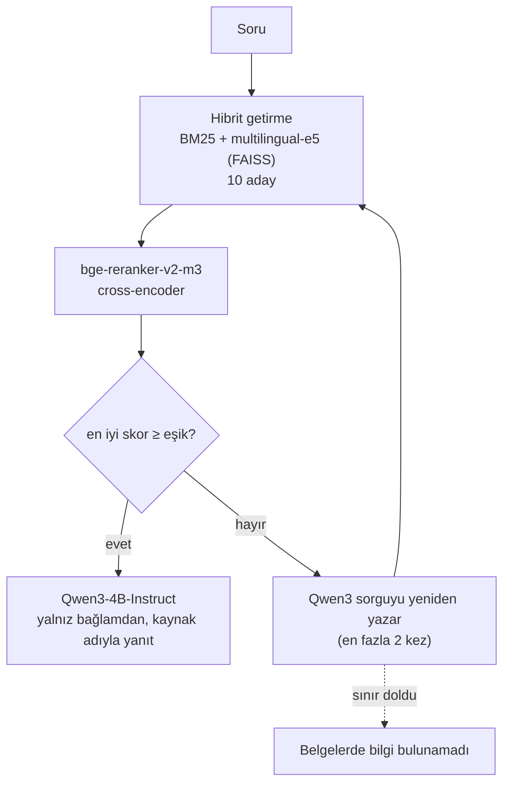
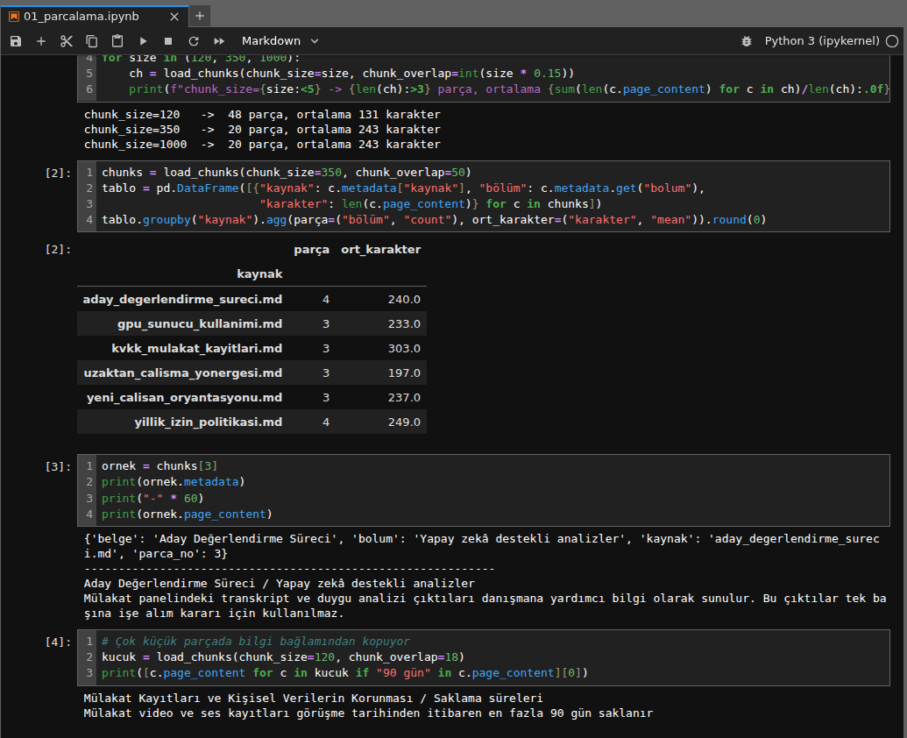
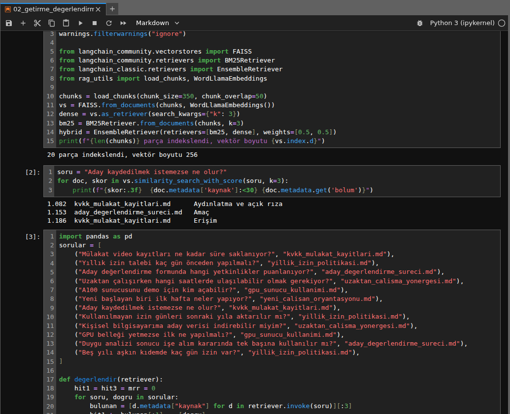
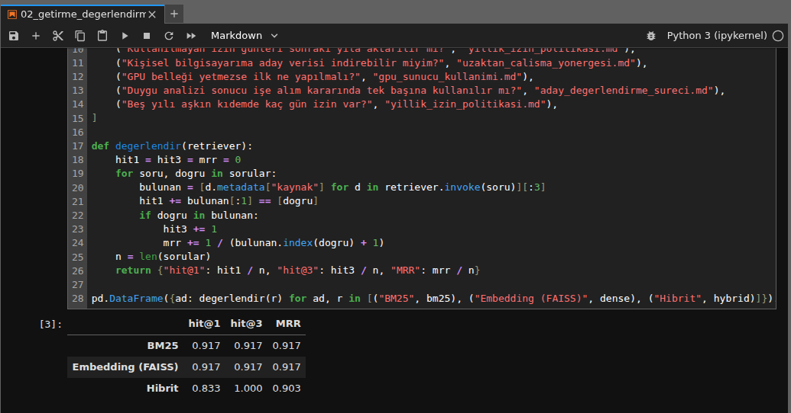

# Türkçe Şirket İçi Belgeler için Agentic RAG

[](https://colab.research.google.com/github/alimdemir/agentic-rag-turkish-docs/blob/main/notebooks/03_colab_e5_reranker_ajan.ipynb)


Şirket içi Türkçe belgeler (izin politikası, KVKK ve mülakat kayıtları, GPU sunucusu kuralları vb.) üzerinde çalışan, **getir → yeniden sırala → gerekirse sorguyu yeniden yaz → kaynaklı yanıt ver** döngüsüne sahip bir RAG sistemi. AVD Teknoloji Danışmanlık'taki stajımın (2026) üçüncü haftasında geliştirdim.

> `belgeler/` klasöründeki 6 belge **sentetik örneklerdir**; gerçek şirket belgelerinin yapısını taklit eder, gerçek içerik barındırmaz.

## Mimari



| Dosya | Görevi |
|---|---|
| `rag_utils.py` | Markdown başlığına + karakter sınırına göre iki aşamalı parçalama; parçanın başına `belge / bölüm` başlığı eklenir. `WordLlamaEmbeddings` (internetsiz) ve `E5Embeddings` (`query:` / `passage:` ön ekleriyle) |
| `rag_eval.py` | 12 soruluk etiketli test kümesi, 3 yanıtsız soru, `hit@1`, `hit@3`, `MRR` |
| `agentic.py` | Eşik ve yeniden yazma sınırı olan ajan döngüsü (model/getiriciden bağımsız, testlerde sahte fonksiyonlarla çalışır) |

## Not defterleri

| Not defteri | Ortam | İçerik |
|---|---|---|
| [`01_parcalama`](notebooks/01_parcalama.ipynb) | CPU | Parça boyutu denemeleri; 120 karakterde "90 gün" ile "2 yıl" kuralının ayrı parçalara düşmesi |
| [`02_getirme_degerlendirme`](notebooks/02_getirme_degerlendirme.ipynb) | CPU, internetsiz | WordLlama + FAISS, BM25 ve hibrit getirme karşılaştırması |
| [`03_colab_e5_reranker_ajan`](notebooks/03_colab_e5_reranker_ajan.ipynb) | Colab T4 | multilingual-e5-base + bge-reranker-v2-m3 + Qwen3-4B-Instruct ile ajan döngüsü, eşik seçimi |

### CPU sonuçları (not defteri 02)

| Yöntem | hit@1 | hit@3 | MRR |
|---|---|---|---|
| BM25 | 0.917 | 0.917 | 0.917 |
| Embedding (WordLlama + FAISS) | 0.917 | 0.917 | 0.917 |
| Hibrit (0.5 / 0.5) | 0.833 | **1.000** | 0.917 |

Hibrit yöntem doğru belgeyi her soruda ilk üçe taşıyor ama ilk sıradaki isabet düşüyor. Bu yüzden ilk getirme geniş bir aday havuzu olarak kullanılıyor, sıralamayı reranker yapıyor.

## Kurulum

```bash
python -m venv .venv && source .venv/bin/activate
pip install -r requirements-dev.txt        # CPU
pytest -v                                  # 6 test
# GPU (Colab) için: pip install -r requirements-gpu.txt
```

## Tasarım kararları

- **Başlık yapısı parça boyutundan önce geliyor.** Bu belgelerde 350 ve 1000 karakterde aynı sayıda parça oluşuyor, çünkü bölümler zaten kısa.
- **FAISS skoru uzaklıktır.** `similarity_search_with_score` L2 uzaklığı döndürür; küçük değer daha yakın demektir.
- **Reranker skoru olasılık değildir.** Eşik, yanıtı olan ve olmayan soruların skorlarına bakılarak seçildi. Küçük küme olduğu için gerçek kullanımda ayrı bir doğrulama kümesi gerekir.
- **Yeniden arama sınırlı.** Sınır dolunca sistem tahmin yürütmüyor, bilginin bulunamadığını söylüyor.

## Ekran görüntüleri

| | |
|---|---|
| <br/>Başlık + karakter sınırıyla parçalama | <br/>FAISS ile getirilen bölümler |
| <br/>BM25 / embedding / hibrit karşılaştırması | |

## Lisans

[MIT](LICENSE)
